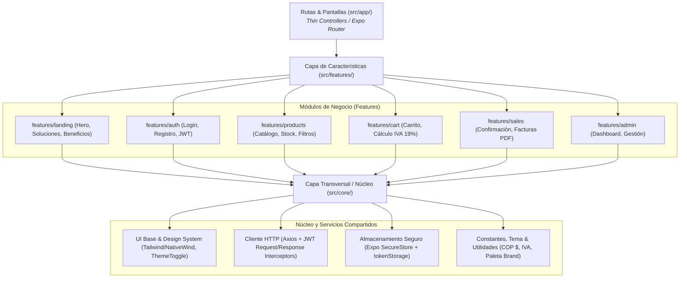
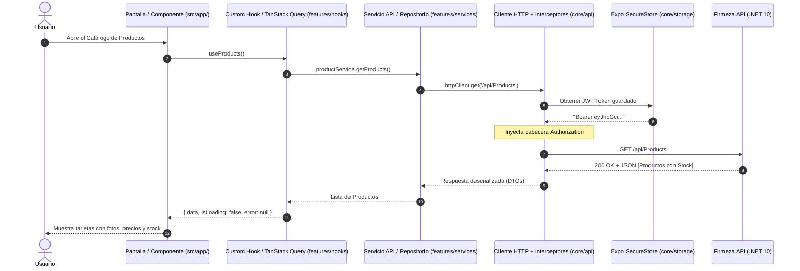

# Firmeza App - Aplicación Móvil & Web del Cliente (US 5)

Aplicación móvil multiplataforma desarrollada en **React Native** con **Expo (SDK 57)** y estilizada con **Tailwind CSS (NativeWind v4)** para la plataforma comercial de ferretería y materiales de construcción **Firmeza**.

Diseñada para funcionar en dispositivos móviles (**Android**, **iOS**) y en navegadores (**Web**), permitiendo a los clientes explorar el catálogo de productos, gestionar su carrito de compras en tiempo real, autenticarse y consultar facturas en PDF generadas por el backend.

---

## 📱 Tecnologías y Herramientas

* **Framework Base:** [React Native 0.86](https://reactnative.dev/) con [React 19](https://react.dev/)
* **Plataforma & Tooling:** [Expo SDK 57](https://expo.dev/)
* **Navegación:** [Expo Router](https://docs.expo.dev/router/introduction/) (enrutamiento declarativo basado en archivos dentro de `src/app/`)
* **Estilos & Diseño:** [NativeWind v4](https://www.nativewind.dev/) + [Tailwind CSS 3.4](https://tailwindcss.com/)
* **Tipado:** [TypeScript 6](https://www.typescriptlang.org/)
* **Animaciones & Gestos:** `react-native-reanimated` y `react-native-gesture-handler`
* **Cliente HTTP & API:** [Axios](https://axios-http.com/) con interceptores Bearer JWT, detección de error 401 y BaseURL dinámica
* **Almacenamiento Seguro:** [Expo SecureStore](https://docs.expo.dev/versions/latest/sdk/securestore/) en móvil con fallback automático a `localStorage` en Web
* **Iconografía:** [Lucide Icons](https://lucide.dev/) (`lucide-react` y `lucide-react-native`) y `expo-symbols`
* **Conexión con Backend:** Consume la API REST de **Firmeza.API (.NET 10)**

---

## 🏛️ Arquitectura del Frontend (Modular Basada en Características / Vertical Slice)

La aplicación implementa una arquitectura **Modular Basada en Características (Feature-Driven Architecture)** combinada con capas de abstracción para garantizar alta cohesión, bajo acoplamiento y máxima escalabilidad:



### Capas del Sistema:

1. **Capa 1: Rutas de Navegación (`src/app/`)**  
   Gestionada declarativamente por **Expo Router**. Las pantallas actúan únicamente como *controladores delgados* (thin screens de 20-40 líneas) que reciben parámetros de ruta y renderizan los contenedores de las características correspondientes.
   * Soporta variantes de plataforma automáticas (`index.tsx` para móvil e `index.web.tsx` para navegadores).

2. **Capa 2: Módulos de Características (`src/features/`)**  
   Cada funcionalidad de negocio es autónoma y agrupa sus propios componentes, hooks, servicios de API, tipos y estado global (ej. `landing`, `auth`, `products`, `cart`, `sales`).

3. **Capa 3: Núcleo y Servicios Transversales (`src/core/`)**  
   Contiene utilidades compartidas entre módulos: cliente HTTP con interceptor automático para el token JWT, almacenamiento seguro local de credenciales, componentes atómicos de diseño y constantes de negocio.

---

## 📁 Estructura del Proyecto

```text
Firmeza/
├── assets/                  # Íconos de la app, imágenes corporativas y splash screen
│   └── images/landing/      # Imágenes y recursos de la Landing Page
├── src/
│   ├── app/                 # Capa 1: Rutas y Navegación (Expo Router)
│   │   ├── _layout.tsx      # Layout global, ThemeProvider y SplashScreen
│   │   ├── index.tsx        # Entrada principal móvil (Renderiza NativeLandingPage)
│   │   ├── index.web.tsx    # Entrada principal web (Renderiza LandingPage responsive)
│   │   ├── explore.tsx      # Pantalla de exploración y búsqueda
│   │   └── +not-found.tsx   # Página de Error 404 Premium interactiva
│   │
│   ├── features/            # Capa 2: Módulos de Negocio (Features)
│   │   ├── landing/         # Landing Page corporativa (Web & Mobile)
│   │   │   ├── components/  # HeroSection, ServiceCardsSection, BenefitsSection, LandingFooter
│   │   │   ├── LandingPage.tsx       # Página principal en Navegador Web
│   │   │   └── NativeLandingPage.tsx # Página principal en Dispositivo Móvil
│   │   ├── auth/            # Autenticación, Login y Registro
│   │   │   ├── components/  # Formularios visuales (LoginForm, RegisterForm)
│   │   │   ├── hooks/       # useAuth, useSession
│   │   │   ├── services/    # authApi.ts (POST /api/Auth/login)
│   │   │   └── types/       # auth.types.ts (User, Token, LoginDto)
│   │   ├── products/        # Catálogo, Stock y Categorías
│   │   │   ├── components/  # ProductCard, StockBadge, CategoryFilter
│   │   │   ├── hooks/       # useProducts, useProductDetail
│   │   │   ├── services/    # productApi.ts (GET /api/Products)
│   │   │   └── types/       # product.types.ts
│   │   ├── cart/            # Carrito de Compras y Totales
│   │   │   ├── components/  # CartItemRow, CartSummary, TaxBreakdown
│   │   │   ├── store/       # useCartStore.ts (Zustand: subtotal, IVA 19%, total)
│   │   │   └── types/       # cart.types.ts
│   │   ├── sales/           # Pedidos, Checkout y Facturas
│   │       ├── components/  # OrderCard, InvoicePdfViewer
│   │       ├── services/    # salesApi.ts (POST /api/Sales, GET invoice-pdf)
│   │       └── types/       # sale.types.ts
│   │   └── admin/           # Panel Administrativo
│   │       ├── AdminDashboardScreen.web.tsx # Dashboard con gráficos (Web)
│   │       └── services/    # adminApi.ts
│   │
│   ├── core/                # Capa 3: Servicios Transversales y Núcleo
│   │   ├── api/             # Cliente HTTP Axios centralizado con interceptores
│   │   │   └── client.ts    # Configuración de baseURL dinámica e inyección de Bearer Token
│   │   ├── storage/         # Persistencia segura de credenciales y usuario
│   │   │   └── tokenStorage.ts # Soporte multiplataforma (SecureStore & localStorage)
│   │   ├── components/      # UI atómica (ThemedText, ThemedView, AnimatedIcon)
│   │   ├── constants/       # Tema, paleta corporativa y constantes de negocio
│   │   │   └── theme.ts
│   │   ├── hooks/           # Custom Hooks de sistema (use-theme, use-color-scheme)
│   │   └── utils/           # Formateadores de moneda (COP $), fechas, etc.
│   │
│   ├── components/          # Componentes compartidos de navegación y diseño
│   │   ├── app-tabs.tsx     # Barra de navegación por pestañas móvil
│   │   ├── app-tabs.web.tsx # Navbar superior interactiva para Web
│   │   ├── theme-toggle.tsx # Conmutador interactivo de Tema Claro / Oscuro
│   │   └── ui/              # Componentes de interfaz detallada
│   │       └── CustomCursor.web.tsx # Cursor personalizado (Pala Dorada) para Web
│   └── global.css           # Directivas globales de Tailwind CSS (NativeWind v4)
├── babel.config.js          # Configuración de Babel con preset NativeWind
├── metro.config.js          # Configuración del empaquetador Metro con soporte CSS
├── tailwind.config.js       # Paleta de colores Firmeza (gold, navy) y fuentes
├── app.json                 # Metadatos y manifiesto de Expo
└── package.json             # Scripts y dependencias del proyecto
```

---

## ⚡ Estándares de Manejo de Estado

* **Estado Local de Componente:** `useState` o `useReducer` para campos de formularios, toggles y modales interactivos.
* **Estado Global de la Aplicación:** [Zustand](https://github.com/pmndrs/zustand) para módulos con persistencia o reactividad en múltiples pantallas (ej. Carrito de Compras y Sesión de Usuario).
* **Estado del Servidor (Server Cache):** Hooks dedicados con manejo de ciclo de vida (`loading`, `error`, `data`) para sincronizar catálogo y stock con el backend .NET 10.

---

## 🚀 Guía de Instalación y Ejecución

### Prerrequisitos

* [Node.js](https://nodejs.org/) (versión 18 o superior recomendada)
* [Expo Go](https://expo.dev/go) instalado en tu celular físico (Android o iOS) o un emulador configurado.

### 1. Instalar dependencias

```bash
npm install
```

### 2. Iniciar el servidor de desarrollo

```bash
# Modo local estándar
npm run start

# Modo LAN (recomendado para probar en celulares en la misma red Wi-Fi)
npm run start:lan
```

### 3. Comandos de ejecución directa

Puedes arrancar directamente la plataforma deseada con los siguientes scripts de `package.json`:

* **Navegador Web:**
  ```bash
  npm run web
  ```
* **Emulador Android (Localhost):**
  ```bash
  npm run android
  ```
* **Emulador o Celular Android (Modo LAN):**
  ```bash
  npm run android:lan
  ```
* **Simulador iOS (macOS):**
  ```bash
  npm run ios
  ```
* **Celular físico con Expo Go:** Escanea el código QR que se imprime en la terminal al ejecutar `npm run start:lan`.

---

## 🔗 Conexión con el Backend (Firmeza.API)

La aplicación cliente se comunica con el backend desarrollado en **.NET 10 (C#)**:

* **Variable de entorno opcional:** Puedes crear un archivo `.env` en la raíz del proyecto para definir la URL exacta:
  ```env
  EXPO_PUBLIC_API_URL=http://localhost:5125/api
  ```
* **Resolución automática de URL:**
  * **Navegador Web:** `http://localhost:5125/api`
  * **Emulador Android:** `http://10.0.2.2:5125/api` (puente automático del emulador hacia el host).
  * **Dispositivo Android por USB (Recomendado):**
    Ejecuta en tu terminal para redirigir el puerto:
    ```bash
    adb reverse tcp:5125 tcp:5125
    ```
    Esto permite al dispositivo móvil acceder a la API local directamente como `http://localhost:5125/api`.
  * **Celular físico por red Wi-Fi:** Configura la IP local de tu computador en la variable `EXPO_PUBLIC_API_URL=http://<TU_IP_LOCAL>:5125/api`.

---

## 🌐 Arquitectura de Consumo de API (Repository / Service Pattern)

Para consumir la API de forma desacoplada y robusta, se implementa el **Patrón Repositorio / Servicio con Interceptores HTTP**:



### Principios del Consumo de API:

1. **Cliente HTTP Centralizado (`src/core/api/client.ts`):**
   * **Request Interceptor:** Lee automáticamente el Token JWT almacenado en `tokenStorage` (`Expo SecureStore` / `localStorage`) y lo inyecta en el encabezado `Authorization: Bearer <token>` de cada petición autenticada.
   * **Response Interceptor:** Captura errores globales. Si el servidor responde `401 Unauthorized` (sesión expirada), limpia las credenciales locales de forma automática.
   * **BaseURL Dinámica:** Se adapta según la plataforma (Web, Emulador Android con `10.0.2.2`, puerto revertido con ADB o variable `EXPO_PUBLIC_API_URL`).

2. **Almacenamiento Seguro Multiplataforma (`src/core/storage/tokenStorage.ts`):**
   * Utiliza el llavero seguro nativo del dispositivo (`Expo SecureStore`) en Android e iOS para almacenar el Token JWT y los datos del usuario.
   * Cuenta con fallback transparente a `localStorage` en navegadores web.

3. **Capa de Servicios / Repositorios (`src/features/<feature>/services/`):**
   * Desacopla la UI de los endpoints. Cada módulo agrupa sus llamadas en funciones puras tipadas (ej. `authService.login()`, `productService.getAll()`, `salesService.createSale()`).

4. **Capa de Hooks y Caché de Servidor (`src/features/<feature>/hooks/`):**
   * Controla el ciclo de vida de los datos (`data`, `isLoading`, `error`, `refetch`) y habilita *Pull-to-Refresh* para verificar stock en tiempo real.

5. **Descarga de Facturas Binarias en PDF:**
   * Las facturas generadas por el endpoint `GET /api/Sales/{id}/invoice-pdf` se procesan mediante `expo-file-system` y `expo-sharing` para su visualización y descarga en el dispositivo móvil.

### Endpoints principales consumidos:
* **Autenticación:** `POST /api/Auth/login` y `POST /api/Auth/register`
* **Catálogo:** `GET /api/Products`
* **Ventas:** `POST /api/Sales` y `GET /api/Sales/{id}/invoice-pdf`

---

## 📋 Estado de la Historia de Usuario 5 (US 5)

| Tarea | Estado |
| :--- | :---: |
| 1. Creación de la aplicación multiplataforma con Expo y React Native | ✅ **Completado** |
| 2. Configuración de Tailwind CSS con NativeWind v4 | ✅ **Completado** |
| 3. Navegación basada en rutas y pestañas con Expo Router | ✅ **Completado** |
| 4. Soporte dinámico para Modo Oscuro y Modo Claro | ✅ **Completado** |
| 5. Pantalla principal y Landing Page corporativa (Web y Móvil) | ✅ **Completado** |
| 6. Integración del cliente HTTP con el backend de Firmeza y persistencia segura de token | ✅ **Completado** |
| 7. Pantalla de inicio de sesión y registro con Token JWT | ✅ **Completado** |
| 8. Catálogo interactivo de productos con stock en tiempo real | ⏳ *En desarrollo* |
| 9. Carrito de compras con cálculo de subtotales e IVA (19%) | ⏳ *En desarrollo* |
| 10. Confirmación de pedido y registro de venta | ⏳ *En desarrollo* |
| 11. Consulta de historial y descarga de facturas en PDF | ⏳ *En desarrollo* |
| 12. Página de Error 404 interactiva con engranajes metálicos 3D animados | ✅ **Completado** |
| 13. Cursores personalizados web (Pala Dorada estática interactiva) | ✅ **Completado** |
| 14. Panel de Administración `/admin` con visualización de estado | ✅ **Completado** |

---

## 📄 Licencia

Este proyecto está bajo la Licencia MIT. Para más detalles, consulta el archivo [LICENSE](LICENSE).
